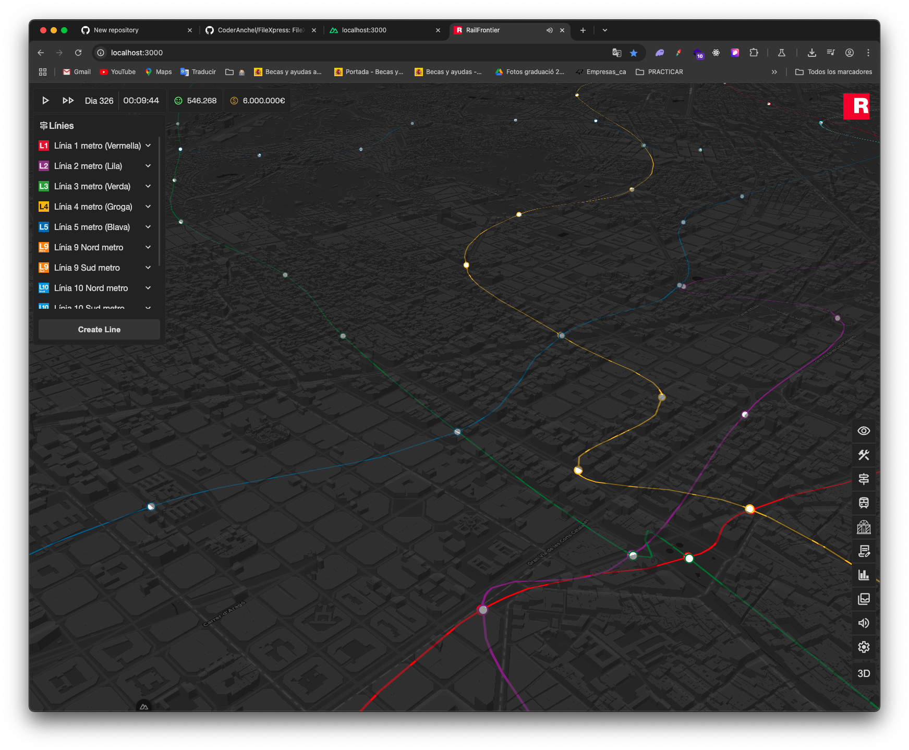
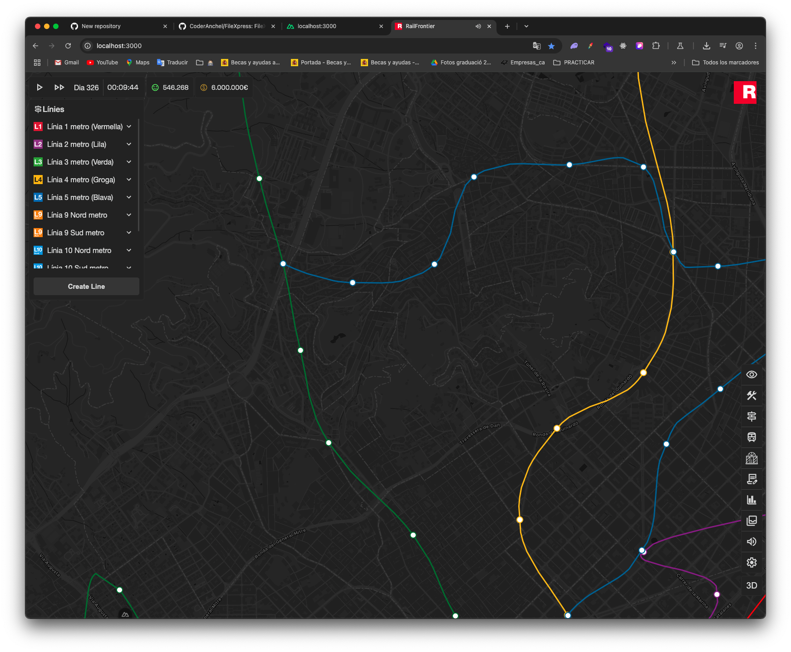

# 🚇 Rail Frontier

An interactive Railway system visualization and simulation project.

## ✨ Features

- 🗺️ Interactive 3D map of Barcelona's metro network
- 🚉 Detailed station information with connections
- 🚂 Complete metro line visualization with accurate routes
- 🔄 Real-time updates and simulations
- 🖱️ Click-and-drag interface for easy navigation
- 🏗️ Tools for planning and creating new metro lines

## 📸 Screenshots

  
  

## 🛠️ Technology Stack

- **Frontend**: Vue 3 with Nuxt.js
- **Maps**: MapLibre GL
- **GeoData**: Turf.js for GIS operations
- **State Management**: Pinia
- **Styling**: SCSS
